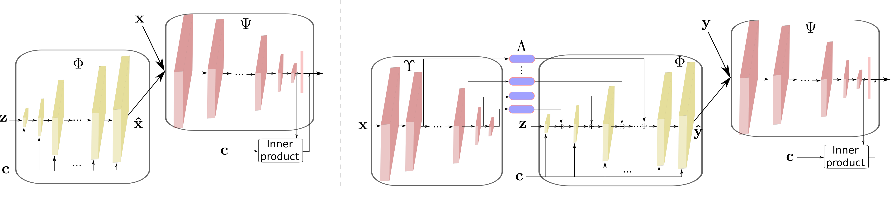
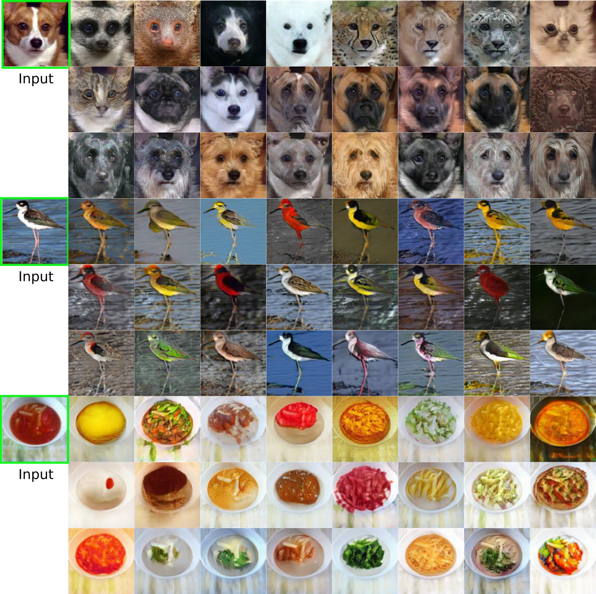
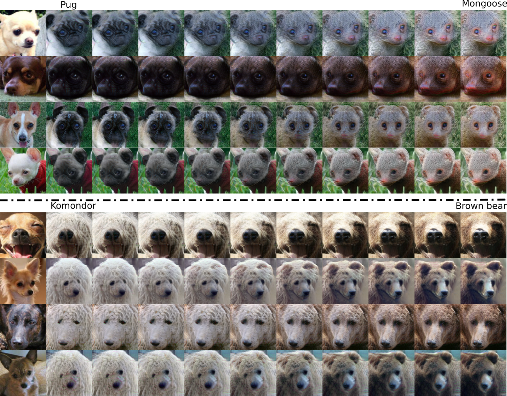

# DeepI2I: Enabling Deep Hierarchical Image-to-Image Translation by Transferring from GANs 
# Abstract: 
Image-to-image translation has recently achieved remarkable results. But despitecurrent success, it suffers from inferior performance when translations betweenclasses require large shape changes. We attribute this to the high-resolution bottle-necks which are used by current state-of-the-art image-to-image methods. There-fore, in this work, we propose a novel deep hierarchical Image-to-Image Translationmethod, calledDeepI2I. We learn a model by leveraging hierarchical features: (a)structural informationcontained in the shallow layers and (b)semantic informationextracted from the deep layers. To enable the training of deep I2I models on smalldatasets, we propose a novel transfer learning method, that transfers knowledgefrom pre-trained GANs. Specifically, we leverage the discriminator of a pre-trainedGANs (i.e.  BigGAN or StyleGAN) to initialize both the encoder and the dis-criminator and the pre-trained generator to initialize the generator of our model.Applying knowledge transfer leads to an alignment problem between the encoderand generator. We introduce anadaptor networkto address this. On many-classimage-to-image translation on three datasets (Animal faces, Birds, and Foods) wedecrease mFID by at least 35% when compared to the state-of-the-art. Furthermore,we qualitatively and quantitatively demonstrate that transfer learning significantlyimproves the performance of I2I systems, especially for small datasets. Finally, weare the first to perform I2I translations for domains with over 100 classes.

# Framework 
 

# Result 
 

# Interpolation 
 

 

# References 
- \[1\] [BigGAN](https://arxiv.org/abs/1809.11096) 
- \[2\] [StyleGAN](https://arxiv.org/pdf/1812.04948.pdf) 

# Contact
If you run into any problems with this code, please submit a bug report on the Github site of the project. For another inquries pleace contact with me: yaxing@cvc.uab.es
